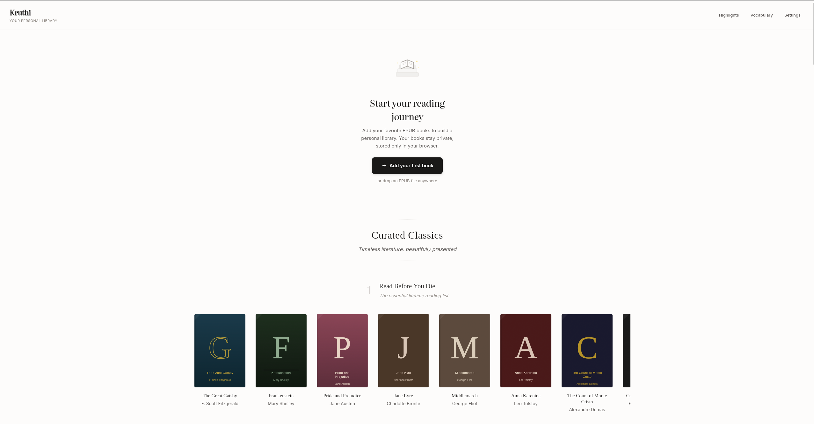
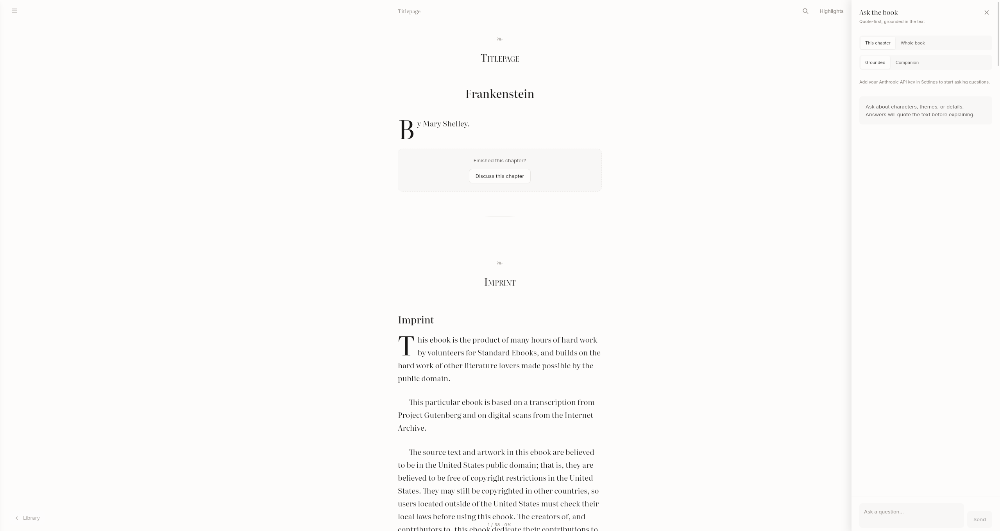

# Kruthi

Kruthi is an EPUB reader with a quote-first AI reading companion. Download public-domain books from Standard Ebooks and Project Gutenberg or drop in your own EPUB, then ask questions answered with quoted passages. Deploy the web app on Cloudflare Pages and grab desktop installers from GitHub Releases.

Name: Kruthi (Kannada: ಕೃತಿ, "a literary work") — [alar.ink](https://alar.ink/dictionary/kannada/english/%E0%B2%95%E0%B3%83%E0%B2%A4%E0%B2%BF)

## What Makes It Different

- Free public-domain classics: a curated shelf from Standard Ebooks and Project Gutenberg.
- Quote-first answers: citations before explanations, with refusals when the text is missing.
- Local-first by default: your library, highlights, and analysis stay on device; AI is opt-in.
- Self-hostable: deploy the web build to Cloudflare Pages.
- Cross-platform: one SvelteKit codebase for web, Tauri for desktop, and Capacitor for mobile.

## Core Features

### Reading
- EPUB upload plus curated downloads.
- Continuous scroll reading with TOC navigation and in-book search.
- Typography controls (font family, size, line height, margins, paper texture).
- Light, sepia, and dark themes with focus mode.

### Library & Highlights
- Bookshelf with reading progress and quick resume.
- Highlights with notes and multiple colors.
- Export highlights to Markdown or a printable page.

### Vocabulary & Definitions
- Built-in dictionary (Webster's 1913) for fast offline definitions.
- Vocabulary list and review flow.

### AI Companion
#### Why AI

AI in Kruthi is there to help you stay with hard books: quick explanations, definitions, and grounded answers when the text is dense. It does not replace reading; it keeps you moving and makes the classics feel more approachable. Everything is citation-first and can be turned off.

- Ask questions with citations from the book.
- Highlight actions (Explain / Define) with grounded responses.
- Chapter summaries, theme tracking, and character profiles.
- Analysis caching for faster repeat responses.

## Screenshots





## Privacy & Data

- Web: IndexedDB + localStorage.
- Desktop: SQLite + filesystem.
- Mobile: SQLite + filesystem.
- AI requests only run when you configure a provider key in Settings.

## Tech Stack

- SvelteKit + Tailwind
- Tauri (desktop) and Capacitor (mobile)
- epub.js for parsing
- Hybrid retrieval (BM25 + embeddings) for citations

## Quick Start

Requirements: Node 22+ (Capacitor 8)

```bash
npm install
npm run dev
```

## Builds

```bash
npm run check
npm run build
npm run build:tauri
npm run build:capacitor
```

## Desktop Downloads

Desktop installers are published on GitHub Releases after a tagged release:

```bash
git tag v0.1.0
git push origin v0.1.0
```

Releases: https://github.com/bebhuvan/kruthi/releases

## Mobile Releases

Capacitor builds are distributed through the app stores (or manual APK sharing), not GitHub Releases.

```bash
npm run cap:sync
npx cap open ios
npx cap open android
```

- iOS: Archive in Xcode, then upload to TestFlight/App Store.
- Android: Generate a signed APK/AAB in Android Studio, then upload to Play Console (or share the APK).

## Docs

- `docs/architecture.md`
- `docs/setup.md`
- `docs/releasing.md`

## License

MIT. See `LICENSE`.
